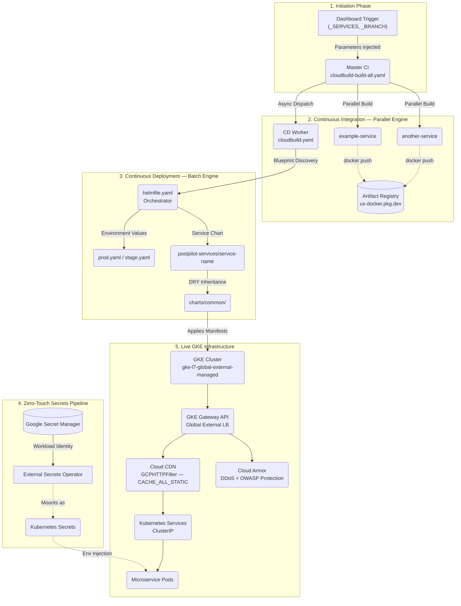

# POSTPILOT DevOps — GKE Fleet Infrastructure & CI/CD Orchestration

> **Production-grade, Dashboard-Driven Kubernetes deployment platform for the POSTPILOT microservices fleet.**
> Built on Google Kubernetes Engine with Helmfile, Cloud Build, Terraform, and the GKE Gateway API.

---

## 📋 Table of Contents

1. [Architecture Overview](#-architecture-overview)
2. [Infrastructure Stack](#-infrastructure-stack)
3. [Repository Structure](#-repository-structure)
4. [CI/CD Pipeline Deep Dive](#-cicd-pipeline-deep-dive)
5. [Helm Architecture — The DRY Library Pattern](#-helm-architecture--the-dry-library-pattern)
6. [Environment Configuration](#-environment-configuration)
7. [GKE Gateway & Dynamic Routing](#-gke-gateway--dynamic-routing)
8. [Cloud CDN Integration](#-cloud-cdn-integration)
9. [Zero-Touch Secret Management](#-zero-touch-secret-management)
10. [Infrastructure as Code (Terraform)](#-infrastructure-as-code-terraform)
11. [DevSecOps Security Shield](#-devsecops-security-shield)
12. [Operational Playbook](#-operational-playbook)
13. [Service Catalogue](#-service-catalogue)

---

## 🗺️ Architecture Overview



---

## 🏗️ Infrastructure Stack

| Layer | Technology | Details |
|-------|------------|---------|
| **Container Orchestration** | GKE `1.35.x` | Zonal cluster in `us-central1-a` (Prod) / `me-central1-a` (UAT) |
| **Load Balancer** | GKE Gateway API | `gke-l7-global-external-managed` — Global External Application LB |
| **SSL Termination** | Certificate Manager | `postpilot-prod-cert-map` / `postpilot-uat-cert-map` via `certMap` binding |
| **Static IP** | GCP Reserved IP | `postpilot-prod-ip` (34.36.56.4) / `postpilot-uat-ip` |
| **Edge Security** | Cloud Armor | `postpilot-prod-security-policy` / `postpilot-uat-security-policy` |
| **CDN** | GCPHTTPFilter | `CACHE_ALL_STATIC` mode, `3600s` default TTL, route-level attachment |
| **Secret Store** | Google Secret Manager | Bridged to pods via External Secrets Operator + Workload Identity |
| **Image Registry** | Artifact Registry | `us-docker.pkg.dev/postpilot-prod/postpilot` (Prod) / `me-central1-docker.pkg.dev/...` (UAT) |
| **IaC** | Terraform `1.5.0` | Remote state in GCS, environment-isolated directories |
| **Package Manager** | Helmfile + Helm | Environment-aware release orchestration |
| **CI/CD** | Google Cloud Build | Three pipelines: Master CI, CD Worker, Infrastructure |

---

## 📂 Repository Structure

```text
.
├── cloudbuild-build-all.yaml        # Master CI — Parallel image builder + CD dispatcher
├── cloudbuild.yaml                  # CD Worker — Batch Helmfile executor
├── cloudbuild-builder.yaml          # Builder Image — Custom postpilot-builder container pipeline
├── cloudbuild-infra.yaml            # Infrastructure Pipeline — Terraform plan & apply
│
├── scripts/
│   └── update-secrets.ps1           # PowerShell bulk-secret sync utility for GSM
│
├── builder-image/                   # Dockerfile for the custom postpilot-builder image
│   └── Dockerfile                   # Contains: gcloud, helm, helmfile, kubectl, python3
│
├── terraform/                       # Infrastructure as Code (see Terraform section)
│   ├── backend.tf                   # GCS remote state config
│   ├── versions.tf                  # Provider version constraints
│   ├── iam.tf                       # IAM role bindings for provisioner SAs
│   ├── environments/
│   │   ├── stage/                   # UAT-specific TF root module
│   │   └── prod/                    # Production-specific TF root module
│   ├── global/                      # Shared global TF resources
│   └── modules/
│       ├── vpc/                     # VPC + Subnet + NAT
│       ├── gke-cluster/             # GKE Cluster + Node Pool
│       ├── lb/                      # Load Balancer + Cert Map + SSL Entries
│       ├── security/                # Cloud Armor policy rules
│       ├── api-gateway/             # (Reserved) API Gateway module
│       ├── db/                      # Database module
│       └── storage/                 # GCS buckets
│
└── deploy-as-code/
    └── helm/
        ├── helmfile.yaml            # ORCHESTRATOR: Release sequencing, env binding
        ├── SECRET_MANAGEMENT.md     # ESO secret naming conventions & prefix-stripping docs
        ├── SERVICE_ONBOARDING.md    # Steps to onboard a new microservice to the fleet
        │
        ├── environments/
        │   ├── prod.yaml            # Production overrides (domains, replicas, CDN on)
        │   └── stage.yaml           # UAT overrides (domains, resource quotas, CDN off)
        │
        └── charts/
            ├── common/              # SHARED LIBRARY — All Kubernetes logic lives here
            │   ├── Chart.yaml
            │   ├── values.yaml      # Fleet-wide safe defaults
            │   └── templates/
            │       ├── _deployment.yaml      # Deployment spec, probes, env injection
            │       ├── _service.yaml         # ClusterIP Service definition
            │       ├── _hpa.yaml             # Horizontal Pod Autoscaler
            │       ├── _externalsecret.yaml  # ExternalSecret → GSM bridge
            │       ├── _backendpolicy.tpl    # GCPBackendPolicy (Cloud Armor + CDN)
            │       ├── _helpers.tpl          # Name/label helpers
            │       └── _serviceaccount.yaml  # KSA with Workload Identity annotation
            │
            └── postpilot-services/       # FLEET FOLDER — Thin config wrappers per service
                ├── postpilot-infra/      # ClusterSecretStore + ExternalSecret bootstrap
                ├── postpilot-gateway/    # GKE Gateway, dynamic HTTPRoutes, CDN filter
                ├── service-template/ # Blank template for new service onboarding
                └── example-service/  # (Example) Application service```

---

## 🚀 CI/CD Pipeline Deep Dive

The platform operates three independent, loosely-coupled Cloud Build pipelines.

### Pipeline 1: Master CI (`cloudbuild-build-all.yaml`)

**Trigger**: Manual, dashboard-driven. No Git commit required.

**Key substitution variables:**

| Variable | Description | Example |
|----------|-------------|---------|
| `_SERVICES` | Space-separated target services, or `all` | `brandkit-app ai-service` |
| `_BRANCH` | Source branch to clone each microservice from | `main` |
| `_REGISTRY_URL` | Artifact Registry base URL | `us-docker.pkg.dev/postpilot-prod/postpilot` |
| `_CD_TRIGGER_NAME` | Name of the downstream CD trigger to invoke | `PROD-CD-Deployer` |

**Execution flow:**
```
1. generate-build-tag    → Creates shared tag: YYYYMMDD-HHMMSS
2. [parallel builds]     → For each targeted service:
                             - Clones private GitHub repo via GITHUB_TOKEN (GSM)
                             - docker build -t <registry>/<image>:<tag>
                             - docker push → Artifact Registry
3. trigger-batch-deploy  → Bundles all targeted services into _TARGET_SERVICES string
                           → gcloud beta builds triggers run <_CD_TRIGGER_NAME>
                             --substitutions _TARGET_SERVICES=... _IMAGE_TAG=...
4. build-summary         → Prints ✅/⏭️ status table for every fleet service

---

## 🛡️ DevSecOps Security Shield

The fleet utilizes a **"Zero-Trust" Scan-Before-Build** architecture. No container image is built or pushed unless it passes mandatory security gates.

### The 7-Stage Microservice Shield

Every service in the fleet follows a standardized 7-stage lifecycle:

| Stage | Process | Tool | Objective |
|:---|:---|:---|:---|
| **1. Checkout** | Source Retrieval | `Git` | Securely clone private repos via `GITHUB_TOKEN`. |
| **2. Secret Scan**| Secret Detection | `Gitleaks` | Detect hardcoded API keys, tokens, and credentials. |
| **3. SAST** | Logic Audit | `SonarQube` | Static analysis for bugs, smells, and vulnerabilities. |
| **4. SAST+** | Rule Audit | `Semgrep` | Pattern-matching for high-risk code (SQLi, XSS). |
| **5. SCA** | Supply Chain | `Trivy FS` | Scans filesystems/dependencies for malware/Kinsing. |
| **6. Build** | Image Creation | `Docker` | Containerization (Only starts if Stages 1-5 pass). |
| **7. Image Scan** | Layered Audit | `Trivy Image` | Final security audit of the OS and built artifacts. |

### Infrastructure Security (IaC)

We use **Bridgecrew Checkov** to audit our infrastructure-as-code (`/terraform` and `/helm`) for cloud-level misconfigurations:
*   **GKE Security:** Ensures network policies are active and pods are non-privileged.
*   **Networking:** Detects overly permissive firewall rules or public load balancers.
*   **IAM:** Audits service account roles for principle of least privilege.

### Security Configuration

*   **Dashboards:** Centralized vulnerability tracking at [SonarCloud.io](https://sonarcloud.io).
*   **Exceptions:** Global false-positives are managed via the central `.trivyignore` file.
*   **Secrets:** All scanner tokens (`SONAR_TOKEN`, `GITHUB_TOKEN`) are managed via **Google Secret Manager**.
```

**Machine type**: `E2_HIGHCPU_8` for maximum parallel throughput.

---

### Pipeline 2: CD Worker (`cloudbuild.yaml`)

**Trigger**: Invoked programmatically by the Master CI pipeline (never triggered manually in normal operation).

**Key substitution variables:**

| Variable | Description |
|----------|-------------|
| `_HELMFILE_ENV` | `uat` or `prod` |
| `_TARGET_SERVICES` | Space-separated service release names |
| `_IMAGE_TAG` | The exact tag built by Master CI |
| `_BUILDER_IMAGE` | The custom `postpilot-builder` image with all tooling |

**Execution flow:**
```
1. Blueprint Discovery   → Parses environment YAML (grep) for cluster_name + location
                           (Zero hardcoded values — self-describing config)
2. Authentication        → gcloud container clusters get-credentials <cluster>
3. Target Identification → Validates _TARGET_SERVICES and _IMAGE_TAG are non-empty
                           (Safety gate: exits 0 if no injection — no accidental deploys)
4. Batch Execution       → Builds Helm dependencies for each release
                           Constructs helmfile selector string:
                             -l name=svc1 -l name=svc2 (OR logic)
                           Applies all releases in ONE atomic call:
                             helmfile -e prod -l name=... apply --set services.<svc>.image.tag=<tag>
5. Verification Summary  → helm status for each release, prints revision + status table
```

**Timeout**: `1800s` (30 minutes) to accommodate large fleet deployments.

---

### Pipeline 3: Infrastructure (`cloudbuild-infra.yaml`)

**Trigger**: Manual, used for provisioning/updating cloud infrastructure.

**Execution flow:**
```
1. fetch-config  → gsutil cp gs://<_BUCKET>/config/<_ENV>/terraform.tfvars
                   (tfvars are stored in GCS, never committed to git)
2. init          → terraform init with GCS backend + SA impersonation
3. plan          → terraform plan -var-file=terraform.tfvars -out=tfplan
4. apply         → terraform apply -auto-approve tfplan
```

---

## ⛵ Helm Architecture — The DRY Library Pattern

All Kubernetes manifest logic is centralized in `charts/common/`. Individual service charts contain **zero business logic** — they are thin wrappers that inherit everything from the common library.

### Example: `postpilot-web/templates/deployment.yaml`
```yaml
{{- template "common.deployment" . -}}
```

That single line is the entire file. Every Deployment in the fleet is generated from `common/templates/_deployment.yaml`.

### Common Library Templates
*   `common.deployment`: Unified Deployment strategy with HPA support.
*   `common.service`: Standardized ClusterIP services.
*   `common.hpa`: Dynamic scaling based on CPU/Memory.
*   `common.backendpolicy`: GKE-specific timeout and health check configuration.

---

## 🌐 Networking & SSL Architecture

The platform uses the **GKE Gateway API** (`gke-l7-global-external-managed`) for global traffic management.

### SSL Certificate Management
*   **Provider**: Google Certificate Manager.
*   **Certificate Type**: Managed certificates with DNS authorization.
*   **Coverage**: All certificates include both wildcard (`*.postpilot.ai`) and apex (`postpilot.ai`) domains.
*   **Infrastructure**: Managed via the `lb` module in Terraform.

### Automatic HTTPS Redirection
The Gateway implements a "Secure-by-Default" policy:
*   **Listener Logic**: The Gateway listens on Port 80 (HTTP) and Port 443 (HTTPS).
*   **Redirection**: All HTTP traffic is automatically upgraded to HTTPS using a `RequestRedirect` filter (Status 301) at the Gateway edge. This ensures no unencrypted data ever reaches the microservices.
*   **Route Isolation**: Traffic is isolated using `sectionName` targeting in `HTTPRoute` resources to distinguish between the redirect listener and the main traffic listener.

---

| Template | Kubernetes Resource | Key Features |
|----------|---------------------|--------------|
| `_deployment.yaml` | `Deployment` | Resource limits, liveness/readiness probes, env injection, GSM annotation timestamp control |
| `_service.yaml` | `Service` (ClusterIP) | Standardized internal port naming, protocol enforcement |
| `_hpa.yaml` | `HorizontalPodAutoscaler` | Memory-threshold-based scaling, configurable min/max replicas |
| `_externalsecret.yaml` | `ExternalSecret` | Automatic GSM label discovery, prefix-stripping rewrite transforms |
| `_backendpolicy.tpl` | `GCPBackendPolicy` | Cloud Armor policy binding, CDN enablement toggle |
| `_serviceaccount.yaml` | `ServiceAccount` | Workload Identity annotation (`iam.gke.io/gcp-service-account`) |

### Helmfile Release Sequencing (`helmfile.yaml`)

Releases are deployed in dependency order using the `needs` directive:

```
external-secrets (CRD installer)
  └── external-secrets-config (postpilot-infra: ClusterSecretStore)
        └── postpilot-gateway (HTTPRoutes + CDN filters)
        └── [all microservices] (depend on external-secrets-config)
```

---

## ⚙️ Environment Configuration

Two environment files drive all cluster-level differences. Services read values via Helmfile's `{{ .Environment.Name }}` templating.

### Environment Comparison

| Setting | UAT (`stage.yaml`) | Production (`prod.yaml`) |
|---------|-------------------|-------------------------|
| Cluster | `postpilot-uat` (me-central1-a) | `postpilot-prod` (us-central1-a) |
| GCP Project | `glassy-storm-491011-q6` | `postpilot-prod` |
| Cert Map | `postpilot-uat-cert-map` | `postpilot-prod-cert-map` |
| Static IP | `postpilot-uat-ip` | `postpilot-prod-ip` |
| Cloud Armor | `postpilot-uat-security-policy` | `postpilot-prod-security-policy` |
| Cloud CDN | `false` | `true` |
| AI Service CPU | 500m req / 2000m limit | 1000m req / 4000m limit |
| AI Service Memory | 3Gi req / 5Gi limit | 4Gi req / 8Gi limit |
| Standard Service CPU | 100m req / 1000m limit | 200m req (no limit set) |
| Image Tag Default | `managed-by-dashboard` | `managed-by-dashboard` |

### Production Host URL Mapping (`prod.yaml → global.host_urls`)

| Key | Production Domain | Service |
|-----|-------------------|---------|
| `example_url` | `api.postpilot.ai` | `example-service` |

---

## 🌐 GKE Gateway & Dynamic Routing

### Architecture

The `postpilot-gateway` chart implements **fully dynamic, environment-aware routing** using the GKE Gateway API (`gke-l7-global-external-managed`). There are no hardcoded domain names anywhere in the codebase.

**How it works:**

1. `global.host_urls` in `prod.yaml` / `stage.yaml` defines the domain-to-key mapping.
2. `routeMapping` in `postpilot-gateway/values.yaml` maps each URL key to a Kubernetes service name.
3. The `httproute.yaml` template iterates over `global.host_urls` and cross-references `routeMapping` to dynamically generate one `HTTPRoute` per domain.

```yaml
# httproute.yaml (simplified)
{{- range $urlKey, $host := .Values.global.host_urls }}
  {{- $serviceName := index $.Values.routeMapping $urlKey }}
  # Generates: HTTPRoute for $host → $serviceName
{{- end }}
```

**Benefit**: Changing a domain requires only one line update in the environment YAML. The Gateway automatically reconciles.

### Route Mapping (`postpilot-gateway/values.yaml`)

```yaml
routeMapping:
  # Example: Link the 'example_url' defined in your environment to the 'example-service'
  # example_url: "example-service"
```

### Gateway Listeners

| Listener | Protocol | Port | Certificate |
|----------|----------|------|-------------|
| `https` | HTTPS | 443 | via `certMap` binding |
| `http` | HTTP | 80 | — |

---

## 🚀 Cloud CDN Integration

CDN is implemented at the **HTTP route filter level** using the GKE Gateway API `GCPHTTPFilter` resource. This is the native CDN mechanism for `gke-l7-global-external-managed` load balancers.

### CDN Filter Configuration (`cdn-filter.yaml`)

```yaml
kind: GCPHTTPFilter
spec:
  cachePolicy:
    cacheMode: CACHE_ALL_STATIC
    defaultTTL: 3600s          # 1 hour default cache TTL
```

### Per-Route CDN Control

CDN is applied per `HTTPRoute` at the filter level. Each route checks two conditions:
1. `global.gateway.cdn.enabled` — Global switch in the environment YAML.
2. `services.<service-name>.cdn_enabled != false` — Per-service opt-out.

This allows disabling CDN for specific services (e.g., highly dynamic auth flows) without affecting the rest of the fleet.

### Current Production CDN State

```
kubectl get httproute -n postpilot -o custom-columns="DOMAIN:.spec.hostnames[0],CDN:.spec.rules[0].filters[0].extensionRef.name"
```

| Domain | CDN Status |
|--------|-----------|
| `api.postpilot.ai` | ✅ `postpilot-gateway-cdn-filter` |

> **Note**: Google Cloud Console Backend Services panel shows "CDN: Disabled" for GKE Gateway-managed backends. This is a known UI limitation — CDN is applied at the routing rule (HTTPRoute filter) level, not at the backend service level. The Console's routing rules section accurately reflects the `cachePolicy` configuration.

---

## 🔐 Zero-Touch Secret Management

Application secrets are **never stored in this repository**. The platform uses a fully automated, keyless pipeline.

### Flow

```
GSM Secret: BRANDKIT_NODE_DATABASE_URL
    │
    ▼ (Workload Identity — no service account keys)
External Secrets Operator (ESO)
    │
    ▼ (ExternalSecret CR — label selector discovery)
Kubernetes Secret: DATABASE_URL
    │
    ▼ (envFrom / secretKeyRef)
Pod Environment Variable
```

### Prefix-Stripping Transform

Each service's `ExternalSecret` is configured with a `rewrite` transform that automatically strips the service-specific prefix. For example:

| GSM Secret Name | Pod Environment Variable |
|-----------------|--------------------------|
| `EXAMPLE_SERVICE_DATABASE_URL` | `DATABASE_URL` |
| `EXAMPLE_SERVICE_API_KEY` | `API_KEY` |

The `ClusterSecretStore` is bootstrapped by the `postpilot-infra` chart using the cluster's Workload Identity service account (`postpilot-app-sa`).

---

## 🏗️ Infrastructure as Code (Terraform)

### State Management

Remote state is stored in GCS with environment-isolated prefixes:

```hcl
# backend.tf
bucket = "postpilot-ai"
prefix = "terraform/state/prod"   # or "uat"
```

Service account impersonation is used for all `terraform init` operations — no long-lived credentials are ever stored.

### Module Catalogue

| Module | Resources Managed |
|--------|------------------|
| `vpc` | VPC, Subnets, Cloud NAT, Router |
| `gke-cluster` | GKE Cluster, Node Pool, Workload Identity |
| `lb` | Certificate Map, Certificate Map Entries, SSL Certs |
| `security` | Cloud Armor Security Policy, Rule Sets |
| `storage` | GCS Buckets, IAM bindings |
| `db` | Cloud SQL instances |
| `api-gateway` | (Reserved) API Gateway configuration |

### Triggering Terraform

```bash
# Via Cloud Build (recommended)
gcloud builds submit --config=cloudbuild-infra.yaml \
  --substitutions=_ENV=prod,_BUCKET=postpilot-ai,_INFRA_SA=postpilot-prod-infra-provisioner@postpilot-prod.iam.gserviceaccount.com

# Manually (for debugging)
cd terraform/environments/prod
terraform init -backend-config="bucket=postpilot-ai" -backend-config="prefix=terraform/state/prod"
terraform plan -var-file=terraform.tfvars
terraform apply
```

---

## 🛠️ Operational Playbook

### How to Deploy (Standard Flow)

> No PR merge required. All deployments are dashboard-driven.

1. Open **Google Cloud Build Console** → Select environment trigger (e.g. `PROD-Master-CI`).
2. Click **Run** and provide substitutions:
   - `_SERVICES`: `all` (or specific services: `brandkit-app ai-service`)
   - `_BRANCH`: `main` (source branch for microservice repos)
3. Monitor the parallel build progress in Cloud Build.
4. The CD worker is automatically triggered. Monitor `cloudbuild.yaml` execution.

---

### How to Deploy a Single Service

```bash
# Manual CD via helmfile (direct cluster access required)
cd deploy-as-code/helm
helmfile -e prod -l name=brandkit-app apply \
  --set services.brandkit-app.image.tag=20260419-092838
```

---

### How to Rollback

> We use tag-based rollback, not Git reverts. Git history stays clean.

1. Find the last stable image tag in **Artifact Registry** (e.g. `20260415-120000`).
2. Trigger the CD worker pipeline manually with:
   - `_TARGET_SERVICES`: `brandkit-app` (or any set of services)
   - `_IMAGE_TAG`: `20260415-120000`
3. The CD worker skips the build step and applies the old tag directly to the cluster.

Or via Helm directly:
```bash
helm rollback brandkit-app 0 --namespace postpilot --wait
```

---

### How to Deploy Only the Gateway (Infrastructure Changes)

When changing routes, CDN settings, or SSL mappings without rebuilding application images:

```bash
cd deploy-as-code/helm
helmfile -e prod -l name=postpilot-gateway apply
```

---

### How to Force CDN Propagation

After changes to `GCPBackendPolicy` or `GCPHTTPFilter`, GKE may take 2–5 minutes to reconcile the load balancer state. To verify CDN filter attachment:

```bash
kubectl get httproute -n postpilot \
  -o custom-columns="ROUTE:.metadata.name,HOST:.spec.hostnames[0],CDN:.spec.rules[0].filters[0].extensionRef.name"
```

---

### Resolving Common Kubernetes Conflicts

**Error: `Duplicate value: 'http'`**
Occurs when a `containerPort` name conflicts between the common library and service-level values.

```bash
kubectl delete deployment <service-name> -n postpilot
# Then re-trigger the CD pipeline to apply a clean deployment
```

**Error: `fault filter abort`**
Occurs when a CDN cache filter is applied to a highly dynamic route that returns non-cacheable responses.

Turn off CDN for that specific service:
```yaml
# prod.yaml
services:
  user-identity:
    cdn_enabled: false
```
Then redeploy: `helmfile -e prod -l name=postpilot-gateway apply`

---

## 📦 Service Catalogue

This repository is currently a **clean baseline template**.

### Adding a New Service

To enable a new service:
1. Copy the `service-template` folder.
2. Add the release to `deploy-as-code/helm/helmfile.yaml`.
3. Add the URL key to `routeMapping` in `postpilot-gateway/values.yaml`.
4. Add the domain to `global.host_urls` in both `prod.yaml` and `stage.yaml` (or `uat.yaml`).
5. Create a `CertificateMapEntry` in Terraform for the new domain.
6. Trigger the Master CI with the new service name.

---

*Architected and maintained by the POSTPILOT DevOps Team.*
*For access requests or questions, contact the active Google Cloud IAM administrators.*
