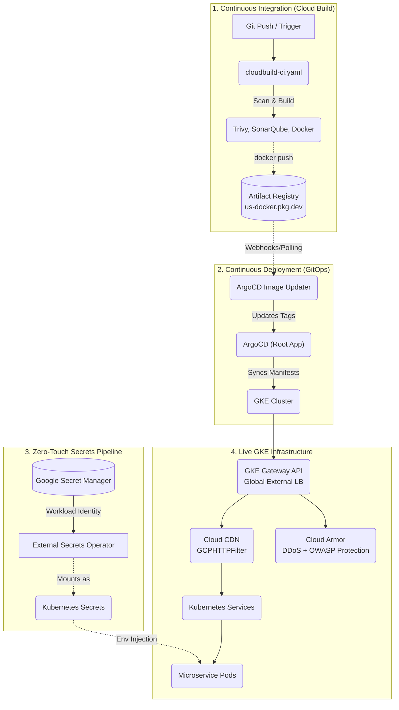

# POSTPILOT DevOps — GitOps Infrastructure & CI/CD Orchestration

> **Production-grade, Dashboard-Driven Kubernetes deployment platform for the POSTPILOT microservices fleet.**
> Built on Google Kubernetes Engine with ArgoCD, Cloud Build, Terraform, and the GKE Gateway API.

---

## 📋 Table of Contents

1. [Architecture Overview](#-architecture-overview)
2. [Infrastructure Stack](#-infrastructure-stack)
3. [Repository Structure](#-repository-structure)
4. [CI/CD Pipeline Deep Dive](#-cicd-pipeline-deep-dive)
5. [GitOps Architecture (ArgoCD)](#-gitops-architecture-argocd)
6. [Environment Configuration](#-environment-configuration)
7. [GKE Gateway & Dynamic Routing](#-gke-gateway--dynamic-routing)
8. [Cloud CDN Integration](#-cloud-cdn-integration)
9. [Zero-Touch Secret Management](#-zero-touch-secret-management)
10. [Infrastructure as Code (Terraform)](#-infrastructure-as-code-terraform)
11. [DevSecOps Security Shield](#-devsecops-security-shield)
12. [Operational Playbook](#-operational-playbook)
13. [Service Catalogue](#-service-catalogue)

---

## 🗺️ Architecture Overview



---

## 🏗️ Infrastructure Stack

| Layer | Technology | Details |
|-------|------------|---------|
| **Container Orchestration** | GKE `1.34.x` | Zonal cluster in `us-central1-a` (Prod) / `me-central1-a` (UAT) |
| **Load Balancer** | GKE Gateway API | `gke-l7-global-external-managed` — Global External Application LB |
| **SSL Termination** | Certificate Manager | `postpilot-prod-cert-map` / `postpilot-uat-cert-map` via `certMap` binding |
| **Static IP** | GCP Reserved IP | `postpilot-prod-ip` / `postpilot-uat-ip` |
| **Edge Security** | Cloud Armor | `postpilot-prod-security-policy` / `postpilot-uat-security-policy` |
| **CDN** | GCPHTTPFilter | `CACHE_ALL_STATIC` mode, `3600s` default TTL, route-level attachment |
| **Secret Store** | Google Secret Manager | Bridged to pods via External Secrets Operator + Workload Identity |
| **Image Registry** | Artifact Registry | `us-docker.pkg.dev/...` |
| **IaC** | Terraform `1.5.0` | Remote state in GCS, environment-isolated directories |
| **Continuous Deployment** | ArgoCD | GitOps automated sync with ArgoCD Image Updater |
| **CI Pipeline** | Google Cloud Build | DevSecOps Pipeline (`cloudbuild-ci.yaml`) |

---

## 📂 Repository Structure

```text
.
├── cloudbuild-ci.yaml               # Standardized DevSecOps CI Pipeline
├── cloudbuild-builder.yaml          # Builder Image — Custom postpilot-builder container pipeline
├── cloudbuild-infra.yaml            # Infrastructure Pipeline — Terraform plan & apply
│
├── deploy-as-code/
│   ├── argocd/
│   │   ├── bootstrap.sh             # Run once to install ArgoCD and Image Updater
│   │   └── root-app.yaml            # ArgoCD App-of-Apps definition
│   │
│   └── helm/
│       ├── environments/            # Environment value overrides (prod.yaml, stage.yaml)
│       └── charts/
│           ├── common/              # SHARED LIBRARY — All Kubernetes logic lives here
│           └── postpilot-services/  # FLEET FOLDER — Thin config wrappers per service
│
├── terraform/                       # Infrastructure as Code
│   ├── environments/                # Environment-specific root modules (prod, stage)
│   ├── global/                      # Shared global resources
│   └── modules/                     # Reusable IaC modules (vpc, gke-cluster, lb, security, db)
```

---

## 🚀 CI/CD Pipeline Deep Dive

The platform uses a modernized, decoupled CI/CD architecture based on GitOps principles.

### Continuous Integration (`cloudbuild-ci.yaml`)

**Trigger**: Code pushes to specific branches or manual execution.

This pipeline enforces a **"Zero-Trust" Scan-Before-Build** architecture. No container image is built or pushed unless it passes mandatory security gates.

**Execution Flow**:
1. **Secret Scan**: Uses `gitleaks` to detect hardcoded API keys and tokens.
2. **SAST**: Uses `SonarQube` to run static analysis for bugs and vulnerabilities.
3. **SCA**: Uses `Trivy FS` to scan dependencies for vulnerabilities.
4. **Build**: Compiles the Docker image (only runs if scans pass).
5. **Image Scan**: Uses `Trivy Image` to scan the built container layers.
6. **Push**: Pushes the image to Artifact Registry with a timestamp tag.

### Continuous Deployment (GitOps via ArgoCD)

We use **ArgoCD** combined with **ArgoCD Image Updater** for deployment. 
- There are no CD pipelines in Cloud Build.
- ArgoCD continuously monitors this Git repository and ensures the GKE cluster state matches the `deploy-as-code/helm/charts` definitions.
- **ArgoCD Image Updater** monitors Google Artifact Registry. When the CI pipeline pushes a new image tag, the Image Updater detects it and automatically commands ArgoCD to deploy the new tag to the cluster, ensuring seamless, hands-free continuous deployment.

---

## ⛵ GitOps Architecture (ArgoCD)

We employ the **"App of Apps"** pattern for deployment management.

- `root-app.yaml`: This single ArgoCD application is manually applied once during cluster bootstrapping (`bootstrap.sh`). It tells ArgoCD to watch the `deploy-as-code/helm/charts/postpilot-services` directory.
- Every new service added to that directory is automatically detected and deployed by ArgoCD.

### The DRY Helm Library Pattern

All Kubernetes manifest logic is centralized in `charts/common/`. Individual service charts contain **zero business logic** — they are thin wrappers that inherit everything from the common library.

**Example**: `postpilot-web/templates/deployment.yaml`
```yaml
{{- template "common.deployment" . -}}
```

This ensures massive scale without configuration drift. The common templates handle Deployments, Services, HPAs, and ExternalSecrets.

---

## ⚙️ Environment Configuration

Two environment files drive cluster-level differences (`prod.yaml` and `stage.yaml`).

| Setting | UAT (`stage.yaml`) | Production (`prod.yaml`) |
|---------|-------------------|-------------------------|
| Cluster | `postpilot-uat` (me-central1-a) | `postpilot-prod` (us-central1-a) |
| GCP Project | `glassy-storm-491011-q6` | `postpilot-prod` |
| Cert Map | `postpilot-uat-cert-map` | `postpilot-prod-cert-map` |
| Static IP | `postpilot-uat-ip` | `postpilot-prod-ip` |
| Cloud Armor | `postpilot-uat-security-policy` | `postpilot-prod-security-policy` |
| Cloud CDN | `false` | `true` |

---

## 🌐 GKE Gateway & Dynamic Routing

The platform uses the **GKE Gateway API** (`gke-l7-global-external-managed`) for global traffic management. There are no hardcoded domain names in the codebase.

1. `global.host_urls` in `prod.yaml` defines the domain-to-key mapping.
2. `routeMapping` in `postpilot-gateway/values.yaml` maps each URL key to a Kubernetes service name.
3. The Gateway automatically provisions `HTTPRoute` resources that map domains to microservices. All HTTP traffic is automatically upgraded to HTTPS (Status 301).

---

## 🚀 Cloud CDN Integration

CDN is implemented at the **HTTP route filter level** using the GKE Gateway API `GCPHTTPFilter` resource.

```yaml
kind: GCPHTTPFilter
spec:
  cachePolicy:
    cacheMode: CACHE_ALL_STATIC
    defaultTTL: 3600s          # 1 hour default cache TTL
```

CDN is enabled per `HTTPRoute` at the filter level and can be disabled on a per-service basis.

---

## 🔐 Zero-Touch Secret Management

Application secrets are **never stored in this repository**. The platform uses a fully automated, keyless pipeline.

```
GSM Secret: BRANDKIT_NODE_DATABASE_URL
    ▼ (Workload Identity)
External Secrets Operator (ESO)
    ▼ (Prefix Stripping Transform)
Kubernetes Secret: DATABASE_URL -> injected into Pod
```

---

## 🏗️ Infrastructure as Code (Terraform)

Remote state is stored in GCS with environment-isolated prefixes (`prefix = "terraform/state/prod"`). Service account impersonation is used for all `terraform init` operations.

### Development / Free-Trial Teardowns

For development and free-trial usage, the standard `prevent_destroy` safety locks have been permanently disabled (`prevent_destroy = false`) on the VPC, Subnet, and GKE Cluster modules. This allows you to rapidly spin up and tear down the expensive components of the environment using `terraform destroy -auto-approve` without hitting safety blocks. 

**Preserving the Static IP:** If you tear down the environment but want to keep your static IP alive in GCP (to avoid breaking your DNS mapping), you must detach it from the Terraform state *before* destroying:
```bash
terraform state rm module.lb.google_compute_global_address.ip
terraform destroy -auto-approve
```
Upon your next rebuild, simply re-import the IP before running apply:
```bash
terraform import module.lb.google_compute_global_address.ip postpilot-prod-ip
```

---

## 🛡️ DevSecOps Security Shield

Every service in the fleet follows a standardized 7-stage lifecycle in `cloudbuild-ci.yaml`:

1. **Checkout**: Securely clone private repos.
2. **Secret Scan**: Detect hardcoded API keys using `Gitleaks`.
3. **SAST**: Static analysis for bugs using `SonarQube`.
4. **SAST+**: Pattern-matching for high-risk code using `Semgrep`.
5. **SCA**: Scans filesystems/dependencies for vulnerabilities using `Trivy FS`.
6. **Build**: Containerization (Only starts if Stages 1-5 pass).
7. **Image Scan**: Final security audit of the built artifacts using `Trivy Image`.

---

## 🛠️ Operational Playbook

### How to Deploy

> All deployments are GitOps-driven via ArgoCD.

1. Trigger the `cloudbuild-ci.yaml` pipeline by pushing to your configured branch.
2. The pipeline will build, scan, and push a new image tag to Artifact Registry.
3. **ArgoCD Image Updater** detects the new tag and commands ArgoCD to automatically deploy it.
4. Monitor the deployment in the ArgoCD dashboard.

### How to Rollback

If a bad deployment goes through:
1. Open the **ArgoCD Dashboard**.
2. Select your application.
3. Click **History and Rollback**.
4. Select the previous healthy deployment state and click **Rollback**. ArgoCD will instantly revert the cluster state.

### How to Force CDN Propagation

After changes to `GCPBackendPolicy` or `GCPHTTPFilter`, GKE may take 2–5 minutes to reconcile the load balancer state. To verify CDN filter attachment:

```bash
kubectl get httproute -n postpilot \
  -o custom-columns="ROUTE:.metadata.name,HOST:.spec.hostnames[0],CDN:.spec.rules[0].filters[0].extensionRef.name"
```

---

## 📦 Service Catalogue

To onboard a new service:
1. Copy the `service-template` folder in `deploy-as-code/helm/charts/postpilot-services/`.
2. Ensure ArgoCD is watching the folder.
3. Add the domain to `global.host_urls` in `prod.yaml`.
4. Commit your changes. ArgoCD will automatically detect and deploy the new service.

---

*Architected and maintained by the POSTPILOT DevOps Team.*
*For access requests or questions, contact the active Google Cloud IAM administrators.*
